# Architecture

See `docs/erd.md` for the data model (tables/relationships). This doc
covers how the code that builds and runs that data model is organized.

This project has two layers, deliberately kept separate:

1. **The SQL lab (`sql/`)** — the source of truth. All business logic —
   stock deduction, order totals, customer tier calculation, low-stock
   detection — lives in MySQL triggers, procedures, and views. This layer
   works standalone: `mysql -u root -p` and `SOURCE scripts/run_all.sql`
   builds the entire database with no Python involved.

2. **The Python orchestration layer (`src/pipeline/`, `scripts/run_pipeline.py`)**
   — a thin runner on top of layer 1. It does not reimplement or duplicate
   any business logic; it only sequences the existing `.sql` files
   phase-by-phase, with structured logging, per-environment configuration,
   and clearer failure attribution than a single monolithic `SOURCE` run.

```mermaid
flowchart TD
    CLI["scripts/run_pipeline.py<br/>CLI entrypoint"]

    subgraph pipeline["src/pipeline/"]
        direction TB
        config["config.py<br/>(env/yaml)"]
        logging["logging_setup.py"]
        core["pipeline.py<br/>(PHASES)"]
        runner["mysql_runner.py"]
    end

    subgraph sql["sql/"]
        direction TB
        schema["schema/"]
        triggers["triggers/"]
        seed["seed/"]
        procedures["procedures/"]
        views["views/"]
        events["events/"]
    end

    DB[("MySQL")]

    CLI --> config
    CLI --> core
    core --> logging
    core --> runner
    runner -->|"shells out to the mysql CLI,<br/>one file at a time"| sql
    sql --> DB
```

Alternatively, `scripts/run_all.sql` drives the same `sql/` tree directly
via `mysql -u root -p < scripts/run_all.sql`, with no Python involved —
see the standalone path below.

## Why shell out to the `mysql` CLI instead of a Python DB driver?

Several `.sql` files use `DELIMITER $$` to define multi-statement
triggers/procedures. That's a client-side meta-command specific to the
`mysql` CLI (and tools that emulate it) — a raw Python driver
(`mysql-connector-python`, `PyMySQL`, etc.) has no concept of it and
can't execute those files as-is. Reusing the same `mysql -e "SOURCE ...;"`
mechanism `scripts/run_all.sql` already depends on means both entrypoints
stay behaviorally identical. `requirements.txt` also includes
`mysql-connector-python`, but only for assertions in
`tests/test_procedures.py` — it is never used to run the phases
themselves.

## Why phases instead of one script?

`scripts/run_all.sql` treats the whole build as one `SOURCE`d block:
a failure partway through prints one error and stops, with no per-step
timing and no easy way to re-run just one part. `src/pipeline/pipeline.py`
breaks the same sequence into named phases (see `docs/pipeline_design.md`),
each logged individually, and exposes `--only <phase>` / `--from <phase>`
so a single phase (e.g. `views`) can be re-run without rebuilding
everything from scratch.

Note that `sql/reports/*.sql` are not part of any phase — they never
were sourced by `scripts/run_all.sql` either. They're standalone
queries you run manually against an already-built database (see the
README's "Common workflows" section), not build steps.
