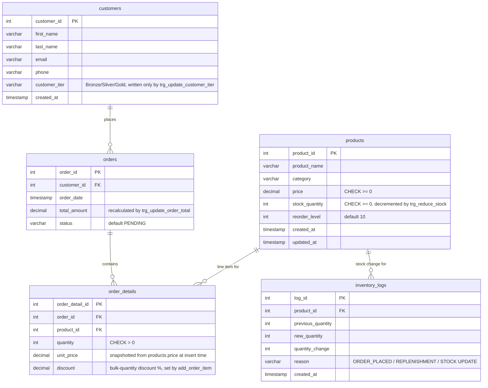

# Entity-relationship diagram

Derived from `sql/schema/*.sql` — see `docs/data_dictionary.md` for full
column-level notes. This is documentation only; the schema files remain
the source of truth.

## Notes

- All foreign keys are `RESTRICT` on delete (no `CASCADE`) — a customer,
  order, or product with dependent rows can never be silently deleted
  along with its history. See the comments in `sql/schema/orders.sql`,
  `order_details.sql`, and `inventory_logs.sql`.
- `customers.customer_tier` is not directly writable by application
  code — it's recomputed by `trg_update_customer_tier` from lifetime
  spend every time an order's `total_amount`/`status` changes.
- `order_details.unit_price` is a snapshot taken at insert time, not a
  live join to `products.price` — so historical orders keep their
  original price even if `products.price` changes later.
